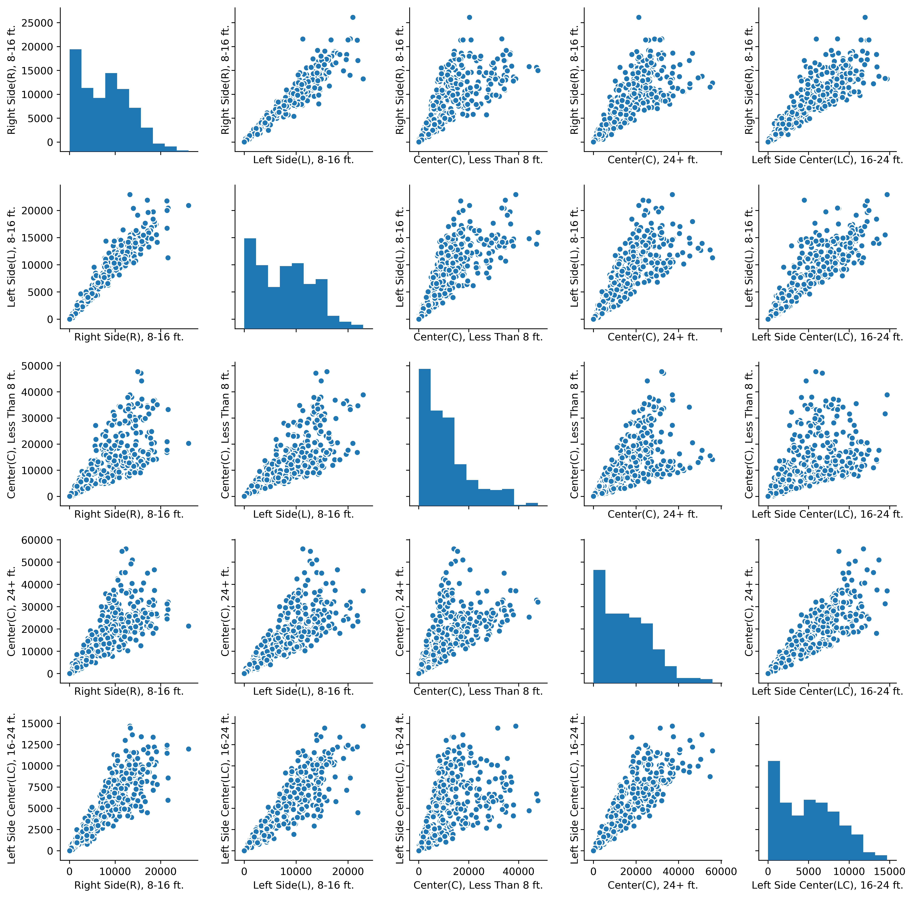
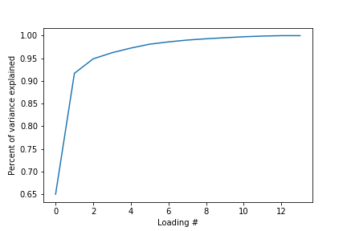
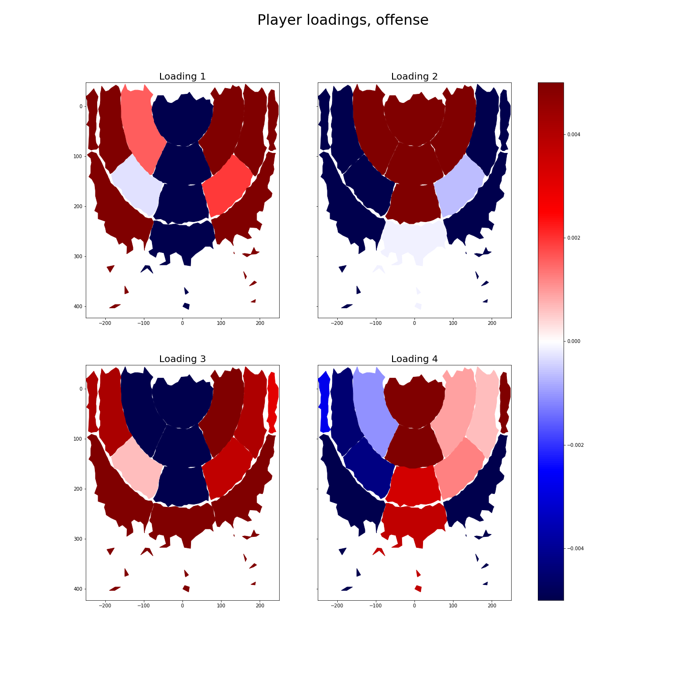
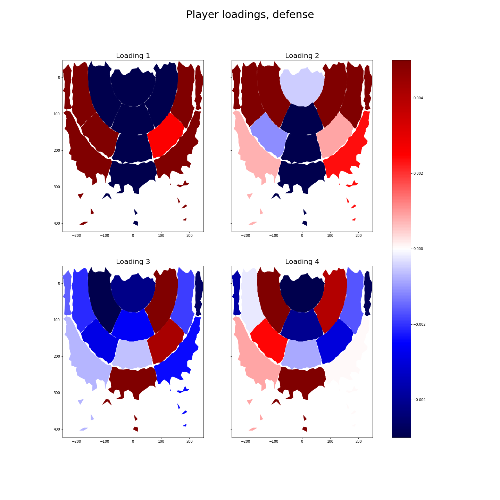
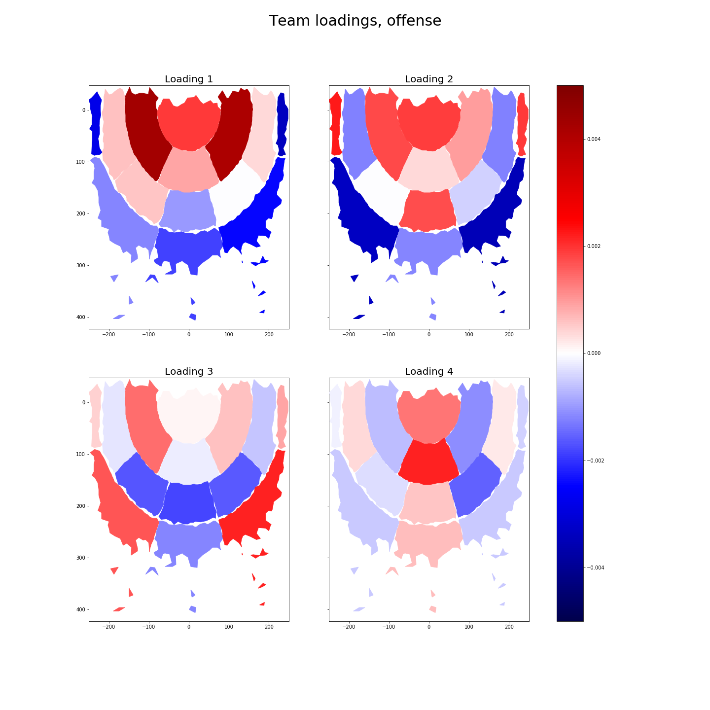
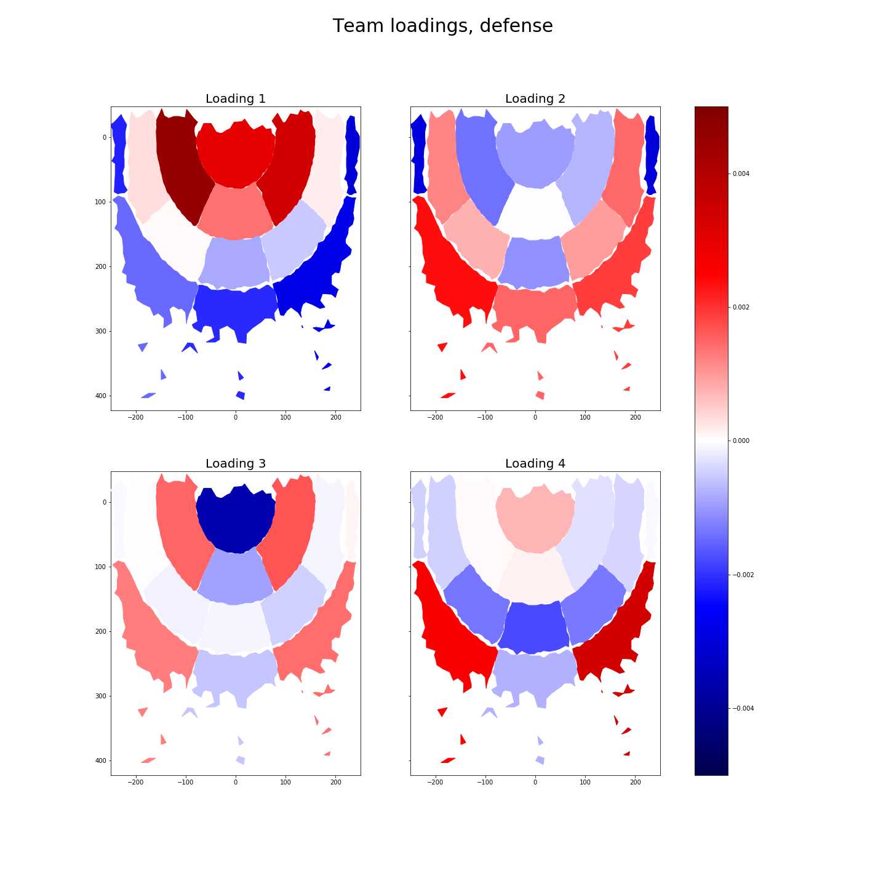

% Stat 363: Final Project
% Authors: Woods Connell, Hannah Knight, Charles Wong, and Samuel Helms

# Introduction

It is extremely common to look at statistics like points scored and rebounds grabbed when evaluating a basketball player. As much as these statistics can tell us about a player, what a player does when he is off the ball has potential to say even more: after all, a player only has a ball for a fraction of the game. In this report, we use data on NBA player's court location, which we sample at a rate of every half second of over 300 games from the 2016 season. 

# Design and Primary Questions

We set out to answer two questions about the movement data and NBA players/teams in this paper:

1. Can we can detect different positions based on where players stand on the court? We use factor analysis and PCA on a matrix that has each player as a data point and fourteen court locations as features, and also on a matrix that has each team as a data point and the fourteen court locations as features. 

2. Do some teams, like the warriors, spend more time out by the three point line? Do others crowd the basket? We try to detect what effect, if any, being on a team has on the locations players inhabit on the court. We use Multivariate Analysis of Variance and Linear Discriminant Analysis to answer these questions.

# Data 

Movement data is no longer released by the NBA, and so it was collected from a public github repository ([https://github.com/sealneaward/nba-movement-data](https://github.com/sealneaward/nba-movement-data)) that backs the data up. In its raw form, this dataset is large in scale, on the scale of 50 gigabytes. It consists of x and y coordinates for every player on the court and the basketball, sampled on .02 second intervals. The NBA only released data for the 2016 season. Our dataset is comprised of about 300 games from the course of that season.

All of our code for data preparation is hosted in the following git repository: https://github.com/samghelms/nba_movement_analysis. Specifically, you can find the data used for this report in the `data` folder. You can build the datasets used for this analysis by running `make_data.py`. You can walk through the code to create the plots in the`pca and factor analysis` jupyter notebook in our github repository - (link) [https://github.com/samghelms/nba_movement_analysis/blob/master/pca%20and%20factor%20analysis.ipynb](https://github.com/samghelms/nba_movement_analysis/blob/master/pca%20and%20factor%20analysis.ipynb).

To winnow the data down, we decided to extract player locations on half second intervals. After doing that, we needed to engineer some features from the player locations: The raw movement data does not come with zone labels. To get these labels, we used a k-nearest neighbors classifier on a dataset of labeled shots. We used code from the following repository to create these labels: [https://github.com/sealneaward/movement-quadrants](https://github.com/sealneaward/movement-quadrants). The author of this repository created the labels by using labeleld shot logs from Kobe Bryant's NBA career.

The table below summarizes our features. We apply various other grouping and striding operations to the data shown below, but this is the set of engineered features that the data sources for all the following analyses stem from.

## The features

| Feature                          | Data Type   | Description                                     | 
|----------------------------------|-------------|-------------------------------------------------| 
|                                  |             |                                                 | 
| Offense or Defense               | Binary      |                                                 | 
| Player name                      | Categorical |                                                 | 
| Team                             | Categorical |                                                 | 
| Right Side(R), 8-16 ft.          |  Continuous | Count data (number of half second intervals in) | 
| Right Side(R), 16-24 ft.         |  Continuous |                                                 | 
| Right Side(R), 24+ ft.           |  Continuous |                                                 | 
| Left Side(L), 8-16 ft.           |  Continuous |                                                 | 
| Left Side(L), 16-24 ft.          |  Continuous |                                                 | 
| Left Side(L), 24+ ft.            |  Continuous |                                                 | 
| Center(C), Less Than 8 ft.       |  Continuous |                                                 | 
| Center(C), 8-16 ft.              |  Continuous |                                                 | 
| Center(C), 16-24 ft.             |  Continuous |                                                 | 
| Center(C), 24+ ft.               |  Continuous |                                                 | 
| Right Side Center(RC), 16-24 ft. |  Continuous |                                                 | 
| Right Side Center(RC), 24+ ft.   |  Continuous |                                                 | 
| Left Side Center(LC), 16-24 ft.  |  Continuous |                                                 | 
| Left Side Center(LC), 24+ ft.    |  Continuous |                                                 | 

The data is very complete--there aren't many skipped half seconds--so we do not have many concerns about error via omission. The biggest potential error would come from our half-second sampling methodology: in a half second, a fast-moving player might cover the space of half the court. We hope that this error will average out in the long run, however.

# Descriptive plots, summary statistics

## Three subsets of the data

We aggregate the data to several levels for the different analyses used in this report. The results of all three of the aggregations for the location data look solid: all have normal distribution of court locations and somewhat linear relationships between all pairs of court locations. The following sections will go into further detail.

### First subset 

The first way in which we aggregate the data is to group by team and offense/defense status and count the number of half seconds players on each team are in specific court locations. We don't want to lump offense and defense in with each other, since standing in a court location on defense can have a very different meaning than standing in the same location on offense. 

This data is available at {INS_LINK}

The first few data points in the dataset, for teams on offense, look like this (some features, like 'Right Side Center(RC), 16-24 ft.' have been omitted for clarity; there are actually 14 court locations that we look at):

Court location                 |Atlanta Hawks. |Boston Celtics |Cleveland Cavaliers|New Orleans Pelicans|Chicago Bulls
-------------------------------|---------------|---------------|------------|---------------|---------------
Right Side(R), 16-24 ft.       |39441.0        |36185.0        |33619.0     |37517.0         |33116.0
Left Side(L), 24+ ft.          |30794.0        |32525.0|27419.0|30732.0|28469.0
Center(C), Less Than 8 ft.|178075.0|165085.0|132478.0|152651.0|152355.0
Right Side Center(RC), 24+ ft.|126667.0|130071.0|112729.0|128496.0|110340.0
Left Side Center(LC), 24+ ft.|144596.0|139255.0|120485.0|138640.0|123351.0

We use this data for factor analysis. We also keep track of what team each player is on for use in the MANOVA later on.

### Second subset 

The second way in which we aggregate the data is to group by player and count the number of half seconds each player is within a specific court location. We use this data for Factor Analysis and also for MANOVA. The layout of the data is similar to the table shown in the section above, but is on the level of players, rather than teams. This data used for the factor analysis is available at {INS_LINK}, and the data used for the MANOVA at {INS_LINK}.

The following pair plot, on a subset of our player data for defense, looks at how well these data fit our assumptions of multivariate normality. You can see from the histograms and the scatter plots that the data are normally distributed and have somewhat linear relationships with each other. This makes us suspect that the data are a good fit for multivariate analyses like MANOVA and linear discriminant analysis.

{ width=80% }

# Multivariate Analysis and discussion of results

## Factor analysis and PCA: distinguishing players and teams based on court locations

First, we will use factor analysis to try and identify court locations that differentiate teams and players from one another. The results that made the most sense came from running factor analysis on a matrix that had been normalized across rows, so that each value corresponding to one of the position parameters represented the probability of a player/team being in that position, instead of being a raw count. We used Sci-Kit Learn's Factor Analysis implementation, since we could only create the plots used below in python (we had to develop a custom plot ourselves using python's matplotlib package).

### Players

First, we ran a PCA to decide how many loadings to use (for the matrices of counts for offense and defense separately). A simple elbow plot suggested that most of of the variance could be explained by the first two loadings for both offense and defense. Because there are many unique play-styles in the NBA, we decided to go ahead and use four components -- explaining the style of a couple players with really unique styles in our model isn't a bad thing.

Then, we used Factor Analysis on a correlation matrix of the data. We chose a correlation matrix because there is such a playtime difference between players, and we didn't want this to bias our data. We don't have to worry about accidentally biasing our data because we have plenty of data on a player even if they spend only minutes on the court.

The results are plotted below. Each element in the loading vector corresponds to a court location, so we have plotted this value on an actual court. Larger values (red in the plot) in a loading vector mean that players that have a higher score for this factor will tend to be in the corresponding area a lot, and smaller values (blue) indicate that a player has a tendency to not be in those regions. We think of these loading values as characterizing the play style of players: For example, a larger value in the loading vector element corresponding with "Right Side(R), 8-16 ft." means that this the play style corresponding with this loading characterized by playing a lot in this zone. 

#### Offense
First, we look at what locations distinguish players from each other on offense. The factor analysis seems to suggest that there are two play styles that characterize basketball players in the NBA: 

{ width=80% }

* The first loading, is a player who stays in areas around the perimeter. These are likely players like guards and small forwards. 

* The second loading likely represents players like centers, who penetrate the center of the court and attack the rim: It is characterized by large values for zones close to the basket.

* The third loading seems similar to the first, with the addition of the center. It is probably detecting guards and avoiding the noise surrounding many people running through the middle of the court

* The fourth loading seems similar to the second, with the addition of perimeter shooting. It could be telling us that there are players who play in the middle and shoot from the perimeter, even though many of these players, like Joel Embiid, do exist.

It is very interesting to see that perimeter players are not characterized by being in the center back-court. This is likely because so players of all types pass through the center to get from one side of the court to another, not because perimeter players never spend time in the center of the back-court.

#### Defense
Next, we look at what locations distinguish players from each other on defense. A plot of cumulative variance explained for the PCA again suggests that there will be up to 6 significant loadings.

The loadings for the factor analysis on defense are much less repetitive than those on offense. All of the first four loadings have some unique characteristics. 

{ width=80% }

* The first loading appears to correspond with players who defend the sides of the court. It suggests that such players are generally ambidextrous in their ability to defend sides of the court. It is interesting to note how such players will often defend all the way up to the net against players on the far right or left. This is likely because players are less concentrated in these areas, and thus one man needs to cover more area on the right or left.

* The second loading likely corresponds with players like center who defend the rim and spend a lot of time underneath the basket.

* The third loading, if it is to be trusted, seems to correspond with a free-ranging type of player on defense, with scatterings of hot spots all over the court.

* The fourth loading seems to be a player heavily focused on defending the perimeter, especially the far right and left regions of the court. It is believable that only certain types of players are likely to defend these regions--a taller player would not want to be drawn so far away from the basket, so it likely falls upon the smaller players to defend these far-drawn regions of the court.

### Teams

#### Offense

{ width=80% }

We perform the same analysis as above, just on a matrix with teams, rather than players, as data points. This analysis is likely less stable, since there are only 30 or so teams in the NBA, and we use fourteen court locations, so the number of features is closer to the number of data than ideal. In contrast with the PCA performed on the players, the cumulative explained variance plot for teams does not reach 90% until the fourth loading.

For offense, we see that some teams are more characterized by their internal play, which makes up the first loading, while others are more by their perimeter play, indicated by the the third loading. The team play styles characterized the the second and fourth loading plots seem to be offenses that are fairly evenly balanced across zones.

It is interesting to see how much more important interior play is on the team level -- the first two loadings are heavily comprised of it. It also makes sense to see perimeter play highlighted in the third, rather than the first or second loadings, since only a few teams in the NBA, like the Houston Rockets and Golden State Warriors, are heavily reliant on their perimeter game, and so a relatively smaller amount of the variance in the data is explained by playing in these zones.

#### Defense

{ width=80% }

The defensive loadings show that some teams rely heavily on their interior defense close to the net, while others (the second loading) have a much more spread out defensive scheme. Loading three is especially interesting, indicating that some teams almost never play defense directly under the net. This could be teams like the Warriors, who don't have an established big man to protect their rim, but do have plenty of players in the 6'6 - 6'9 range who can play around the rim. It also might just indicate that some teams don't like to risk jumping in the way of some driving to the rim for a dunk, which risks a high-speed midair collision.

## MANOVA and LDA: Examining the effect team has on court location for players.

People often say that NBA teams like the Spurs have distinctive play styles--"systems". This section will try and verify this claim using Multivariate Analysis of Variance and Linear Discriminant Analysis to search for a relationship between team and the locations players stand in on the court.

You can read through the code we used to run MANOVA and LDA at the following link: {INS_HANNAH_NB_LINK}

According to MANOVA, only {INS_VAR} and {INS_VAR} are significantly different among teams

To examine how much of a role the team plays in determining what zones people spend time in.

# Conclusions and Discussion

In conclusion, we find that movement data can characterize player styles. The biggest differences in play style that highlighted by these models is playing on the outside of of three point arc versus playing on the inside of the arc. Player locations are, in some sense, the rawest form of data available on the NBA, less abstracted than points scored, rebounds, or blocks; thus we are able to trust our conclusions from this analysis more than an analysis that was based on standard statistics like points. 

The models used in our analyses are not very complex, and as a result, the conclusions we can make are not very deep. Getting such interesting and interpretable results with simple methods like factor analysis is very encouraging for further analyses of these movement data; with more flexible models, such as a neural network, even deeper conclusions could possibly be drawn.

# Points for further analysis

Although looking at where players were at a single point in time told us a lot about NBA games, looking at their transitions could potentially tell us even more. This type of data, which would be very high dimensional, would not be a good candidate for factor analysis or PCA, since the number of features would outstrip the number of players or teams. It would, however work very well for clustering analyses. If we had time and space for another analysis, we would like to delve into

It would also be interesting for someone with more in depth knowledge of players in the NBA to go through and inspect what factors specific players scored high in. Would a player like Stephen Curry, the NBA's former most valuable player, who is known for his three point shooting, have high factor scores with respect to zones outside of the three point arc? 

# Data

Data is available in the `data` folder of the following github repository: [https://github.com/samghelms/nba_movement_analysis](https://github.com/samghelms/nba_movement_analysis). The following notebook walks through the analyses we used to create the plots in this report.
